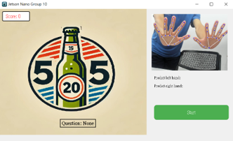

# Dementia-Gesture-Game
Jetson Nano 密集課程專題 - Group 10  
在這一個project中，我們訓練了一個MLP模型，用以判斷手部骨架資料，最終在jetson nano上設計出了互動式猜酒拳遊戲。
此外，我們也嘗試了使用pre-trained model，如YOLO、ResNet50...等模型。

## 遊戲GUI: 

## Dependency:

