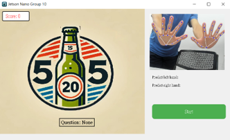
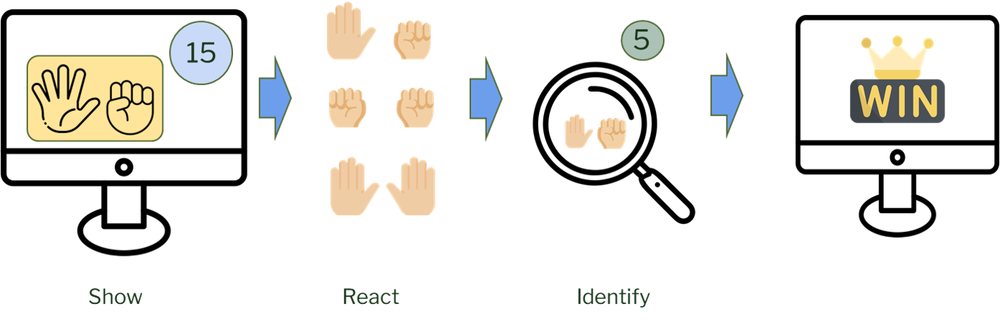
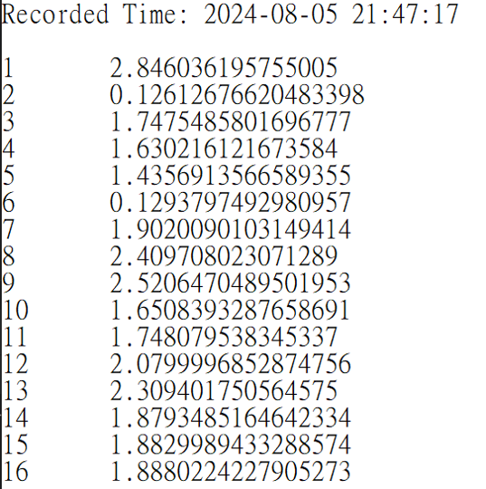

# Dementia-Gesture-Game 
## Jetson Nano 密集課程專題 - Group 10  
In this project, we trained an MLP model to analyze hand skeleton data and ultimately designed an interactive rock-paper-scissors game on the Jetson Nano.

## Purpose
With the growing aging population, it is estimated that by 2050, 131 million people will suffer from dementia. Studies have shown that finger exercises can improve cognitive function and delay the progression of mild cognitive impairment (MCI) to dementia.


The objectives of this game are:

Promote Cognitive Health: Stimulate the brain through finger exercises to improve or maintain cognitive function in older adults.

Delay Cognitive Decline: Encourage sustained physical activity through gameplay, potentially slowing cognitive deterioration.

Enhance Social Interaction: Provide a platform for older adults to interact with others, fostering social engagement.

Improve Quality of Life: Help seniors stay mentally and physically active while enjoying the game.

## Game GUI: 


## Flow chart of gaming


The UI displays a question, and the players perform actions based on the question. When the total number of fingers on the table matches the question, the player loses one point.


## Build project on Jetson Nano:
Python version: 3.6.9  
Jetpack version: 4.6.1  
Docker image for built envrionment: ```docker pull jim0406/nano_course:latest```, which this docker is based from 
https://jetson-docs.com/libraries/mediapipe/l4t32.7.1/py3.6.9

Ensure that X11 and USB devices are mounted when starting the Docker container:
```
docker run -it --rm \
  --device=/dev/video0:/dev/video0 \
  -v /tmp/.X11-unix:/tmp/.X11-unix \
  -e DISPLAY=$DISPLAY \
  --privileged \
  my_docker_image
```
## Other function in this game:
To record the reaction time for each round of rock-paper-scissors.



## Debug:
Connection bug in Jetson USB device (X11 display error): 
```
xhost +SI:localusr:root
docker restart
```
On the Jetson platform, X11 is a windowing system used to manage displays.  
By default, X11 only allows access to the current user, which prevents applications inside the Docker container (such as GUI applications) from being displayed on the host screen.  
The command modifies the X11 access control list to allow the root user (the default user in Docker containers) to use the host's display device.


